# Restauracja Smaku

Projekt strony restauracji przygotowany w React i Vite.

Pierwsza konfiguracja Firebase została opisana krok po kroku w
[FIREBASE_SETUP.md](FIREBASE_SETUP.md). Instrukcja obejmuje emulatory bez
konta Google oraz konfigurację prawdziwego projektu Firebase.

## Uruchomienie

```powershell
npm install
Copy-Item .env.example .env
npm run dev
```

Po uruchomieniu aplikacja jest dostepna lokalnie pod adresem pokazanym w terminalu, domyslnie:

```text
http://127.0.0.1:5173/
```

## Przydatne komendy

```powershell
npm run build
npm run lint
npm test
npm run test:rules
npm run emulators
```

## Firebase

Uzupełnij `.env` danymi dedykowanego projektu deweloperskiego Firebase. Do
pracy wyłącznie na emulatorach ustaw `VITE_USE_FIREBASE_EMULATORS=true`.
Firestore Emulator używa portu `8085`, ponieważ standardowy port `8080`
może być zajęty przez lokalne usługi.

Firebase Emulator wymaga JDK 21. Skrypty `test:rules` i `emulators`
automatycznie wybierają lokalne JDK 21 na Windows, jeśli domyślny `java`
wskazuje starszą wersję.

W Firebase Authentication włącz tylko Email/Password. W ustawieniach Identity
Platform wyłącz tworzenie i usuwanie kont przez użytkowników końcowych, włącz
ochronę przed enumeracją adresów oraz ustaw hasła na minimum 12 znaków z małą
i wielką literą, cyfrą i znakiem specjalnym.

Konta pracowników tworzy administrator w Firebase Console. Dostęp do panelu
wymaga dokumentu `staff/{uid}` z polami `email`, `displayName` i `createdAt`.
Aplikacja nie ma funkcji rejestracji ani nadawania uprawnień.

Projekt jest demonstracją. Publicznego formularza nie należy łączyć z realnymi
danymi klientów bez App Check/reCAPTCHA lub backendowego limitowania żądań,
monitoringu kosztów i ustalonej retencji danych.


## Integracja Google Analytics z Vercel

1. **Zmienne Środowiskowe:** Identyfikator `G-########` wstrzykiwany jest przez zmienną `import.meta.env.VITE_GOOGLE_ANALYTICS_ID` w panelu **Vercel** (Settings -> Environment Variables)

2. **Obsługa SPA (React Router):** Ze względu na brak przeładowań strony w architekturze SPA, w pliku `src/App.jsx` zaimplementowano komponent `<AnalyticsTracker />`. Wykorzystuje on hook `useLocation()`, aby przy każdej zmianie podstrony (np. `/menu`, `/kontakt`) automatycznie wysłać zdarzenie do GA4.

**Przepływ:** Kliknięcie linku -> React Router (`useLocation`) -> Odczyt klucza z Vercel -> Panel GA4

### Raport Google Analytics w czasie rzeczywistym na zdeployowanej aplikacji na vercelu:
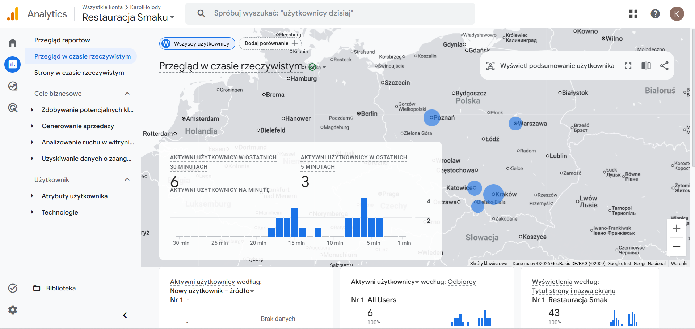
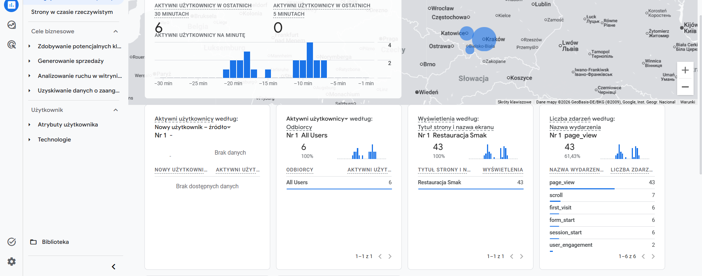

## Opis aplikacji

**Restauracja Smak** to witryna internetowa dla fikcyjnej restauracji serwującej kuchnię polską z nowoczesnym akcentem. Aplikacja została zbudowana w **React + Vite** z **Firebase** jako backendem (Firestore, Authentication) i wdrożona na platformie **Vercel**.

Celem projektu było stworzenie pełnoprawnej witryny restauracyjnej, która zastępuje papierowe menu i telefoniczny system rezerwacji — umożliwiając gościom przeglądanie oferty i rezerwację stolika bezpośrednio przez przeglądarkę.

## Zaimplementowane funkcjonalności

### Menu cyfrowe
- Przeglądanie dań pogrupowanych w kategorie: Wszystkie, Przystawki, Dania Główne, Desery, Napoje
- Wyszukiwarka dań po nazwie
- Filtry: **Wegetariańskie** (V) i **Bezglutenowe** (GF) z oznaczeniami na kartach dań

### System rezerwacji stolika
- **Krok 1 – Terminarz:** wybór daty z kalendarza (blokada przeszłych dat), liczba gości, wybór godziny z dostępnych godzin
- **Krok 2 – Sala:** wybór strefy spośród trzech opcji: Sala Główna, Sala VIP, Ogródek Letni
- **Krok 3 – Dane:** formularz z imieniem i nazwiskiem, telefonem, e-mailem, liczbą osób i opcjonalnymi uwagami
- **Krok 4 – Potwierdzenie:** ekran sukcesu z podsumowaniem rezerwacji (data, godzina, liczba osób, sala)

### Kontakt
- Dane kontaktowe (adres, telefon, e-mail)
- Godziny otwarcia
- Formularz kontaktowy (imię, e-mail, temat, wiadomość)
- Osadzona mapa Google z przyciskiem „Otwórz w Mapach"

### Panel pracownika
- Logowanie przez Firebase Authentication 
- Widok dzisiejszych rezerwacji z godziną, danymi gościa i wybraną salą
- Dostęp wyłącznie dla kont z dokumentem `staff/{uid}` w Firestore
- Przycisk wylogowania

## Wygląd aplikacji

### Strona główna
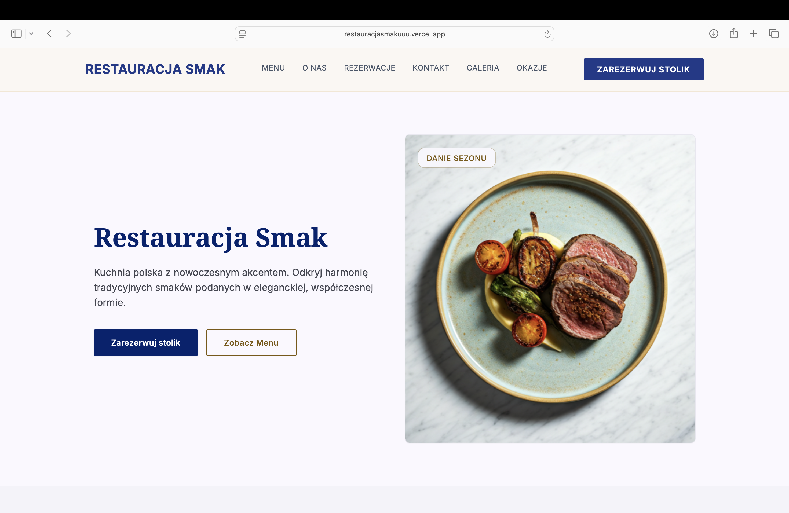
Nazwa restauracji, opis, przyciski oraz wyróżnione zdjęcie dania sezonu.

### Menu cyfrowe
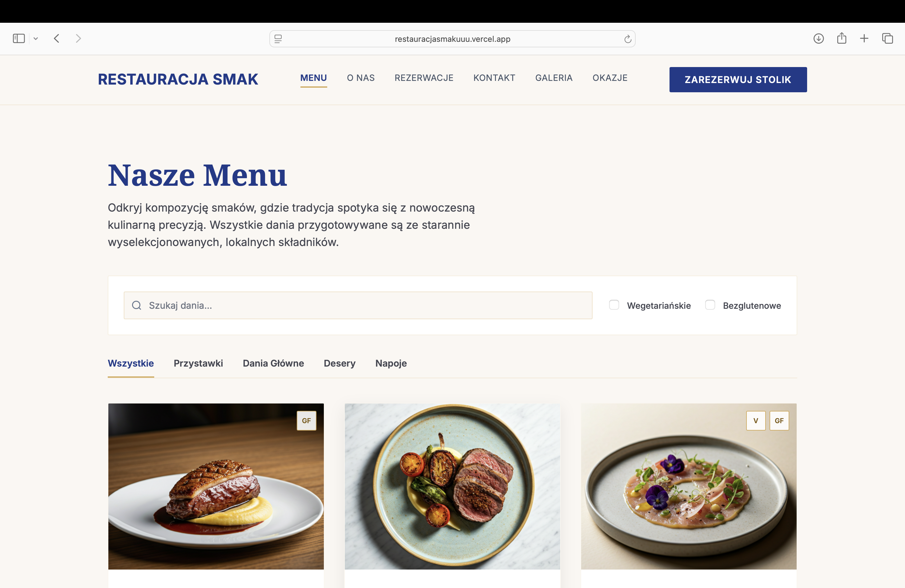

Widok menu z wyszukiwarką, filtrami (Wegetariańskie / Bezglutenowe) i zakładkami kategorii. Karty dań zawierają zdjęcie oraz oznaczenia V/GF w rogu.

### Rezerwacja – Krok 1: Terminarz
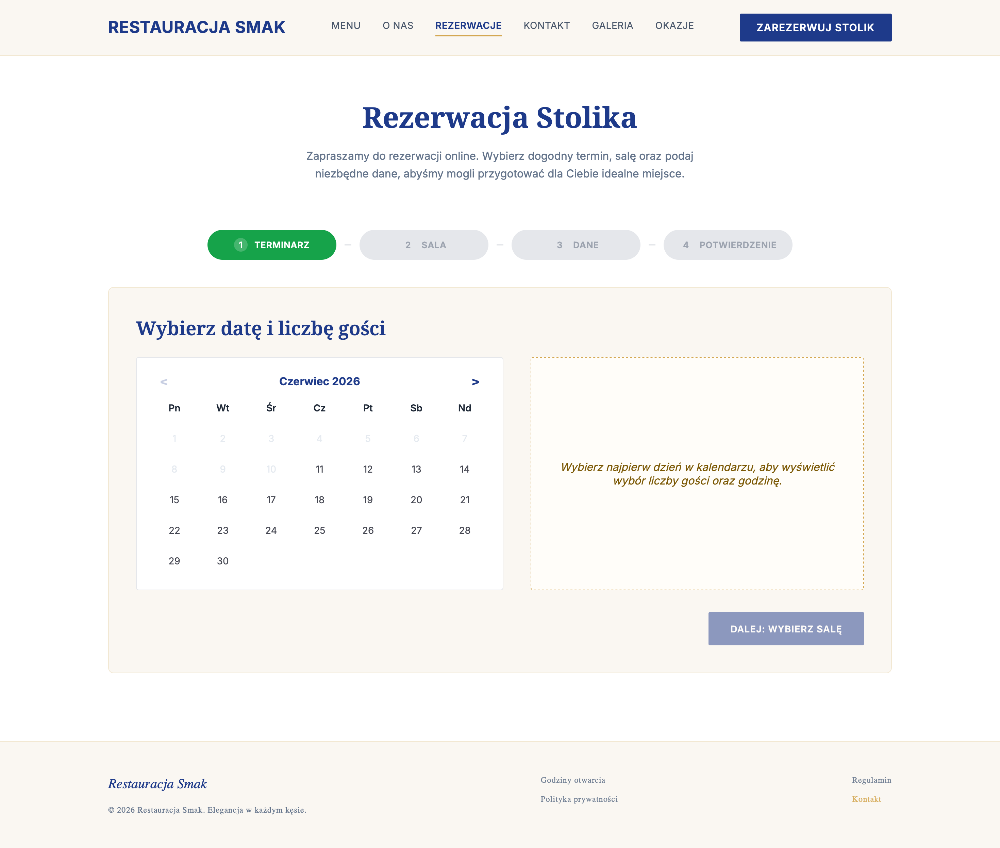

Widok przed wyborem daty — prawa kolumna pokazuje komunikat zachęcający do kliknięcia w dzień. Przeszłe daty są wyszarzone i nieaktywne.

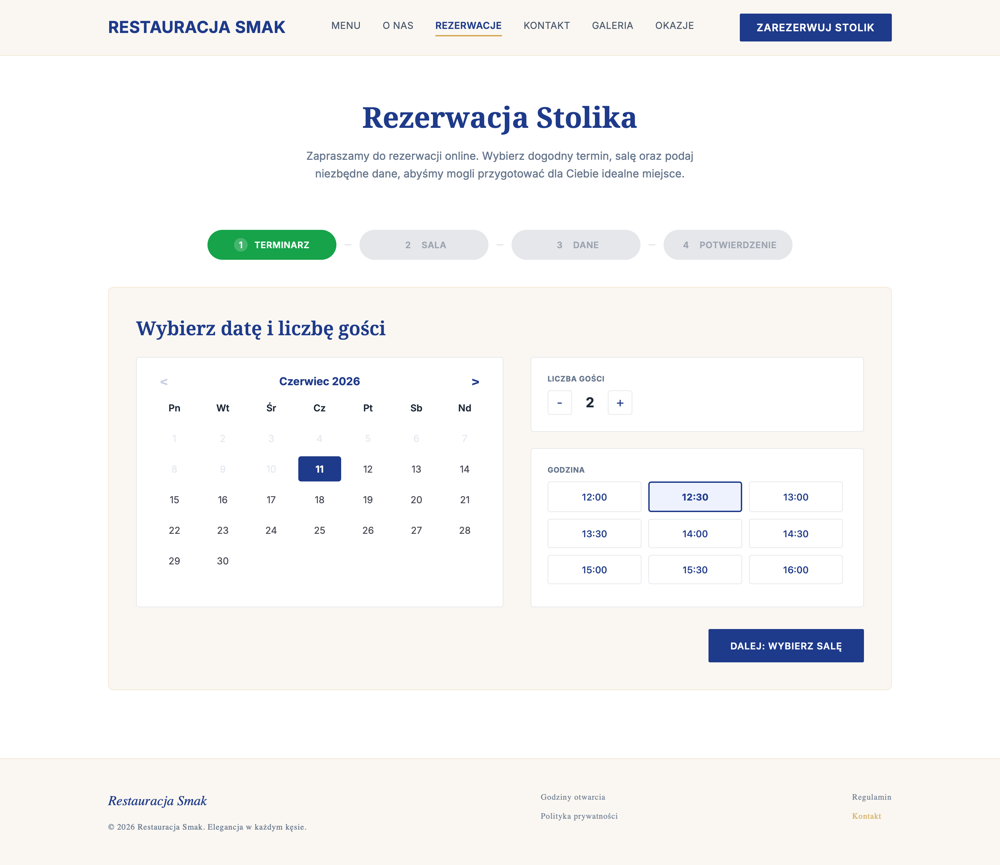

Po wybraniu dnia pojawia się mozliwosc wyboru liczby gości i siatka godzinowa. Wybrana godzina jest podświetlony.

### Rezerwacja – Krok 2: Wybór sali
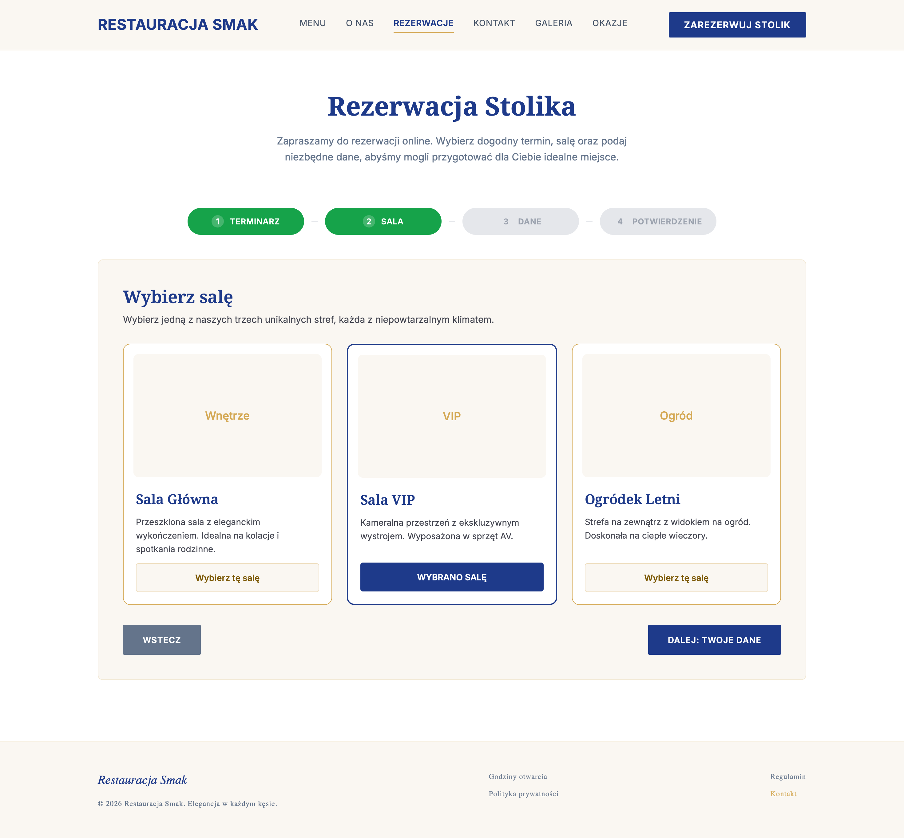

Trzy karty stref: Sala Główna, Sala VIP, Ogródek Letni — każda z placeholderem zdjęcia, opisem i przyciskiem wyboru. Wybrana sala jest obramowana i zmienia tekst przycisku na „WYBRANO SALĘ".

### Rezerwacja – Krok 3: Dane gościa
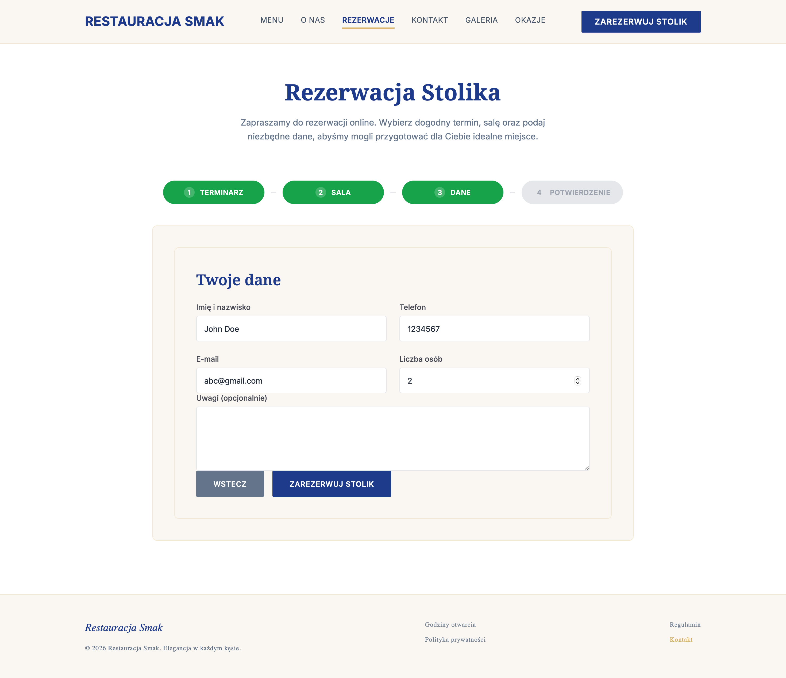

Formularz z czterema polami (imię, telefon, e-mail, liczba osób) i polem uwag. Przyciski „Wstecz" i „Zarezerwuj stolik".

### Rezerwacja – Krok 4: Potwierdzenie
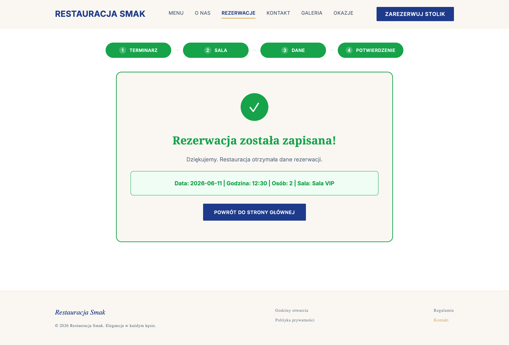

Ekran sukcesu z zieloną ikoną, tytułem „Rezerwacja została zapisana!" i podsumowaniem danych. Przycisk powrotu do strony głównej.

### Kontakt
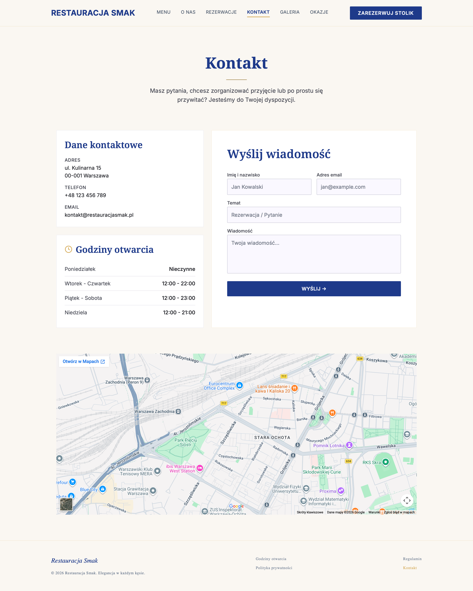

Sekcja z danymi kontaktowymi i godzinami otwarcia (lewa kolumna) oraz formularzem kontaktowym (prawa kolumna). Pod sekcją osadzona mapa Google.

### Panel pracownika – logowanie
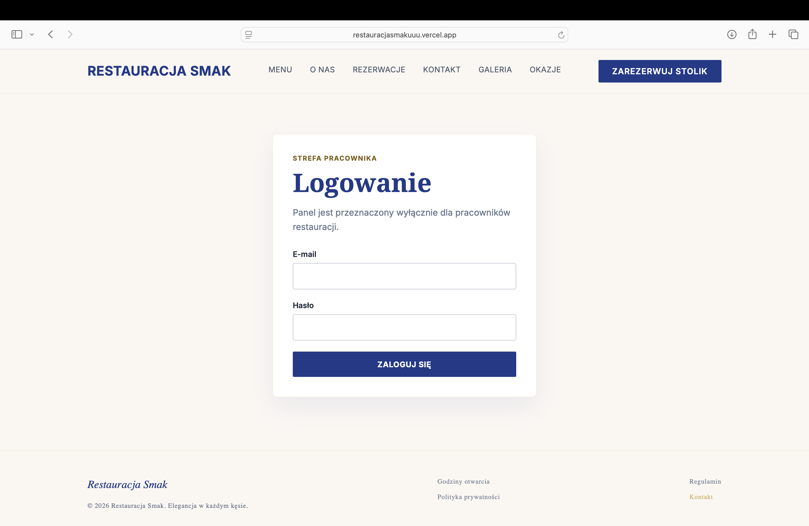

Formularz logowania dostępny wyłącznie dla pracowników restauracji. Brak możliwości rejestracji — konta tworzy administrator w Firebase Console.

### Panel pracownika – dzisiejsze rezerwacje
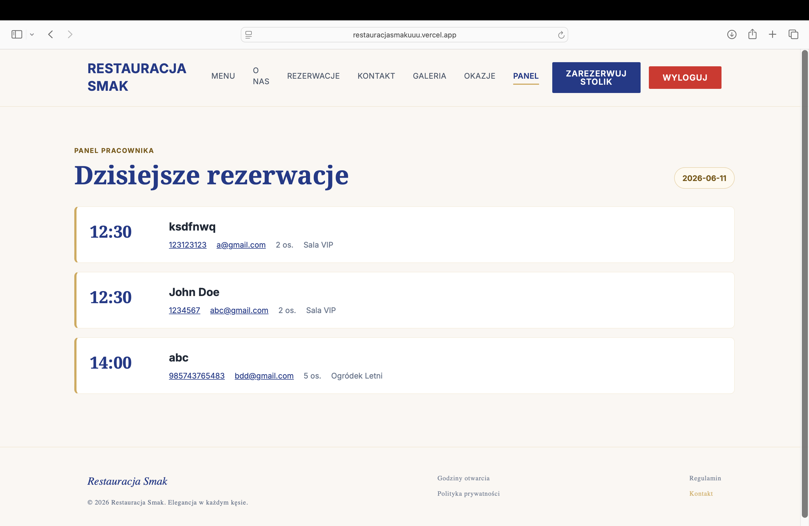

Lista dzisiejszych rezerwacji posortowana godzinowo. Każdy wpis zawiera godzinę, imię i nazwisko, telefon, e-mail, liczbę osób i wybraną salę.